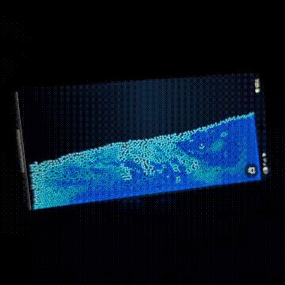

# mobile-fluid-sim

A real-time fluid simulation that runs in your browser and reacts to mobile device sensors. Built using the FLIP (Fluid-Implicit-Particle) technique for realistic fluid dynamics.

**[Try it live at fluid.sh4jid.me](https://fluid.sh4jid.me)**

## Demo



## About

This project implements fluid simulation techniques taught by the amazing [Ten Minute Physics YouTube channel](https://www.youtube.com/channel/UCTG_vrRdKYfrpqCv_WV4eyA), particularly from [this video](https://youtu.be/XmzBREkK8kY).

The initial inspiration for this project came from [Nicholas L. Johnson's flip-card project](https://github.com/Nicholas-L-Johnson/flip-card/).

Since creating this simulation, it has become my go-to digital fidget toy.

## Todo

- [ ] Add viscosity control
- [ ] Add finger interaction options

## Development

```bash
pnpm install
pnpm dev
```

## License

MIT License - see [LICENSE](LICENSE) file for details.

## Contributing

Pull requests are welcome! Feel free to contribute improvements or new features.
